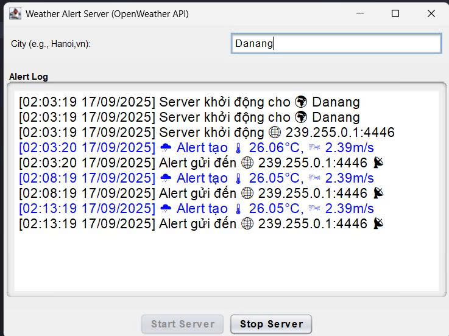
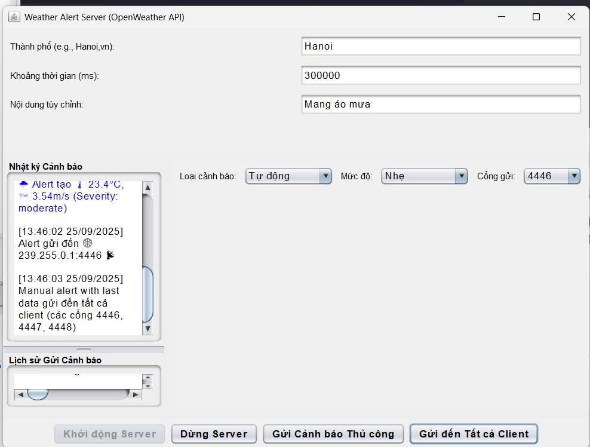
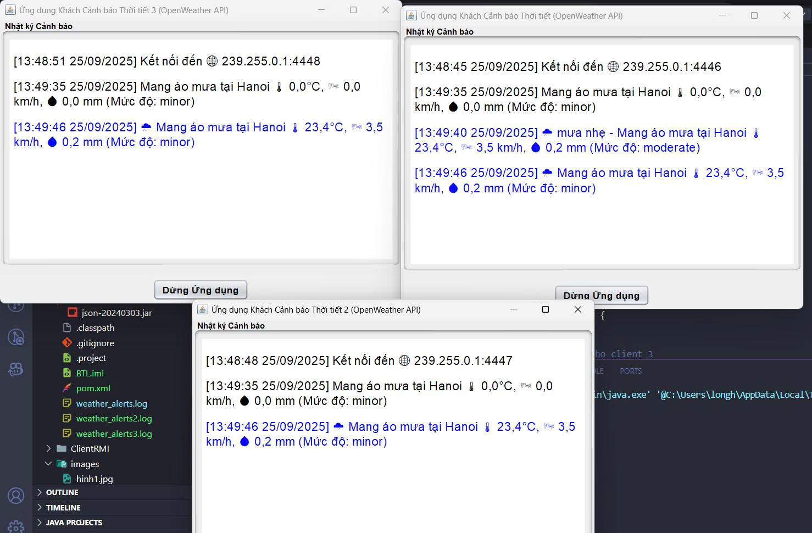
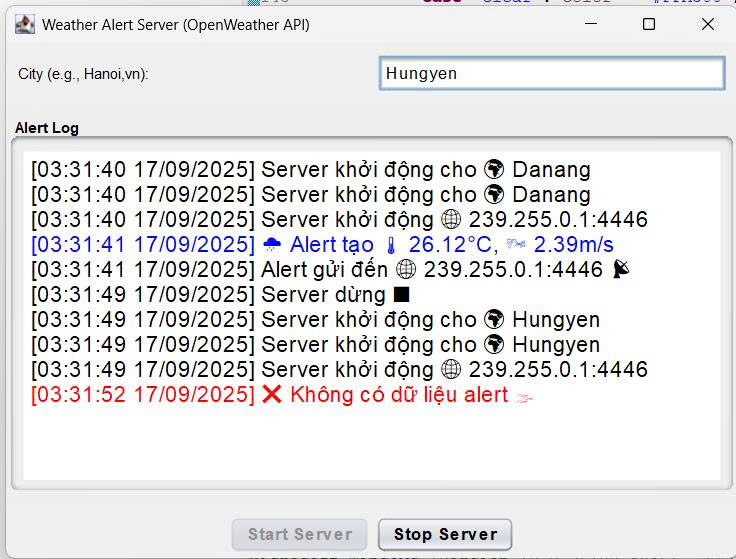

<h2 align="center">
    <a href="https://dainam.edu.vn/vi/khoa-cong-nghe-thong-tin">
    🎓 Faculty of Information Technology (DaiNam University)
    </a>
</h2>
<h2 align="center">
    HỆ THỐNG CẢNH BÁO THỜI GIAN THỰC (SERVER GỬI CẢNH BÁO TỚI NHIỀU CLIENT QUA UDP)
</h2>
<div align="center">
    <p align="center">
        
        
        
    </p>

[](https://www.facebook.com/DNUAIoTLab)
[](https://dainam.edu.vn/vi/khoa-cong-nghe-thong-tin)
[](https://dainam.edu.vn)

</div>


## 📖 1. Giới thiệu hệ thống

Hệ thống cảnh báo thời gian thực sử dụng giao thức UDP cho phép server gửi các cảnh báo thời tiết đến nhiều client theo thời gian thực thông qua cơ chế multicast.

**Server: Thu thập dữ liệu thời tiết từ OpenWeather API, định kỳ gửi các cảnh báo đến một nhóm multicast.**

**Client: Nhận dữ liệu từ nhóm multicast và hiển thị cảnh báo trên giao diện người dùng (GUI).Lưu trữ dữ liệu: Các cảnh báo được lưu vào file văn bản (weather_alerts.log) để theo dõi lịch sử.**  

Các chức năng chính:

**🖥️ Chức năng của Server:**  

- Thu thập dữ liệu thời tiết: Gọi API OpenWeather để lấy thông tin thời tiết (nhiệt độ, tốc độ gió, lượng mưa, mô tả thời tiết) cho một thành phố cụ thể.  
- Gửi cảnh báo: Sử dụng giao thức UDP multicast để gửi các cảnh báo thời tiết đến tất cả client trong nhóm multicast.  
- Quản lý lịch sử: Ghi lại các cảnh báo vào log (GUI và file).  
- Xử lý lỗi: Xử lý các lỗi liên quan đến API hoặc kết nối mạng, hiển thị thông báo trên GUI.  
- Giao diện người dùng: Cung cấp GUI để nhập tên thành phố, khởi động/dừng server, và hiển thị log cảnh báo.

**💻 Chức năng của Client:**  

- Kết nối nhóm multicast: Tham gia vào nhóm multicast để nhận dữ liệu từ server.  
- Hiển thị cảnh báo: Nhận và hiển thị thông tin thời tiết (mô tả, nhiệt độ, tốc độ gió, lượng mưa) trên GUI.  
- Giao diện người dùng: Hiển thị các cảnh báo với màu sắc và biểu tượng cảm xúc phù hợp (mưa, bão, nắng nóng, v.v.).  
- Lưu trữ lịch sử: Lưu các cảnh báo vào file weather_alerts.log với dấu thời gian.  
- Quản lý trạng thái: Cho phép dừng client và ngắt kết nối khỏi nhóm multicast.

**🌐 Chức năng hệ thống:**  

- Giao thức UDP Multicast: Sử dụng DatagramSocket và MulticastSocket để gửi/nhận dữ liệu qua nhóm multicast (239.255.0.1:4446).  
- Dữ liệu JSON: Dữ liệu thời tiết được truyền dưới dạng chuỗi JSON, chứa các thông tin như loại cảnh báo, mô tả, nhiệt độ, tốc độ gió, lượng mưa, vị trí, và thời gian.  
- Lưu trữ file: Các cảnh báo được ghi vào file weather_alerts.log theo định dạng có dấu thời gian.  
- Xử lý lỗi: Hiển thị thông báo lỗi trên GUI và ghi log chi tiết.


## 🔧 2. Công nghệ sử dụng


Các công nghệ được sử dụng để xây dựng hệ thống cảnh báo thời gian thực:  

**Java Core và Multithreading: Sử dụng Timer và Thread để định kỳ gửi cảnh báo và xử lý kết nối mạng.**  

**Java Swing: Xây dựng giao diện người dùng cho cả server và client.**

**Java Sockets (UDP): Sử dụng DatagramSocket và MulticastSocket cho giao thức UDP multicast.**

**File I/O: Ghi lịch sử cảnh báo vào file văn bản (weather_alerts.log).**

**JSON Processing: Sử dụng thư viện org.json để xử lý dữ liệu thời tiết từ API.**

Hỗ trợ:  

**java.net và java.io: Xử lý kết nối mạng và đọc/ghi file.**

**java.text.SimpleDateFormat: Tạo dấu thời gian cho các bản ghi log.**  

**javax.swing.text.html: Hiển thị log với định dạng HTML (màu sắc, biểu tượng).** 

Không sử dụng cơ sở dữ liệu, đảm bảo ứng dụng nhẹ và dễ triển khai.


## 🚀 3. Hình ảnh các chức năng

<p align="center">
  
</p>

<p align="center">
  <em> Hình 1: Giao diện Server hiển thị log cảnh báo và nút điều khiển  </em>
</p>

<p align="center">
  
</p>
<p align="center">
  <em> Hình 2: Giao diện các Client hiển thị các cảnh báo thời tiết </em>
</p>


<p align="center">
  
</p>
<p align="center">
  <em> Hình 3: Lịch sử cảnh báo được lưu vào file weather_alerts.log </em>
</p>

<p align="center">
  
</p>
<p align="center">
  <em> Hình 4: Hiển thị thông báo lỗi khi kết nối API thất bại </em>
</p>


## 📝 4. Hướng dẫn cài đặt và sử dụng

### 🔧 Yêu cầu hệ thống

- **Java Development Kit (JDK)**: Phiên bản 8 trở lên
- **Hệ điều hành**: Windows, macOS, hoặc Linux
- **Môi trường phát triển**: IDE (IntelliJ IDEA, Eclipse, VS Code) hoặc terminal/command prompt
- **Bộ nhớ**: Tối thiểu 512MB RAM
- **Dung lượng**: Khoảng 10MB cho mã nguồn và file thực thi
- **Tệp cấu hình**: File config.properties chứa API key và URL của OpenWeather API.


## 📦 Cài đặt và triển khai

#### Bước 1: Chuẩn bị môi trường
1. **Kiểm tra Java**: Mở terminal/command prompt và chạy:
   ```bash
   java -version
   javac -version
   ```

Đảm bảo cả hai lệnh đều hiển thị phiên bản Java 8 trở lên.

2. **Tải mã nguồn**: Sao chép thư mục `BTL` chứa các file:
- `AlertServer.java`
- `AlertServerGUI.java`
- `AlertClientGUI.java`
- `AlertClientGUI2.java`
- `AlertClientGUI3.java`
- `Config.java`
- `config.properties (cần cấu hình WEATHER_API_KEY và WEATHER_API_URL).`


Cấu hình file config.properties:
- `WEATHER_API_KEY=your_openweather_api_key`
- `WEATHER_API_URL=http://api.openweathermap.org/data/2.5/forecast`
- `DEFAULT_CITY=Hanoi,vn`


#### Bước 2: Biên dịch mã nguồn

1. **Mở terminal** và điều hướng đến thư mục chứa mã nguồn
2. **Biên dịch các file Java**:
   ```bash
   javac Alert/*.java
   ```
   Hoặc biên dịch từng file riêng lẻ:
   ```bash
   javac Alert/AlertServer.java
   javac Alert/AlertServerGUI.java
   javac Alert/AlertClientGUI.java
   javac Alert/AlertClientGUI2.java
   javac Alert/AlertClientGUI3.java
   javac Alert/Config.java
   ```

3. **Kiểm tra kết quả**: Nếu biên dịch thành công, sẽ tạo ra các file `.class` tương ứng.


#### Bước 3: Chạy ứng dụng

**Khởi động Server:**
```bash
java Alert.AlertServerGUI
```
- Giao diện server sẽ hiển thị.
- Nhập tên thành phố (ví dụ: Hanoi,vn) và nhấn "Start Server".
- Server sẽ gửi cảnh báo đến nhóm multicast 239.255.0.1:4446 mỗi 5 phút.

**Khởi động Client:**
```bash
java Alert.AlertClientGUI
java Alert.AlertClientGUI2
java Alert.AlertClientGUI3
```

- Mở terminal mới cho mỗi client.
- Client tự động tham gia nhóm multicast và hiển thị các cảnh báo thời tiết.

### 🚀 Sử dụng ứng dụng

1.**Server:**

- Nhập tên thành phố vào ô nhập liệu.
- Chọn loại cảnh báo, mức độ nghiêm trọng, khoảng thời gian, nội dung tùy chỉnh.
- Nhấn "Khởi động Server" để bắt đầu gửi cảnh báo.
- Nhấn "Gửi Cảnh báo Thủ công" để gửi thủ công đến cổng được chọn.
- Nhấn "Gửi đến Tất cả Client" để gửi đến tất cả client cùng lúc.
- Nhấn "Dừng Server" để dừng.
- Log cảnh báo được hiển thị trên GUI và lưu vào file weather_alerts.log.
- Lịch sử gửi cảnh báo được hiển thị trong vùng "Lịch sử Gửi Cảnh báo".


2.**Client:**

- Tự động nhận và hiển thị các cảnh báo thời tiết từ server.
- Nhấn "Dừng ứng dụng" để ngắt kết nối và thoát.
- Các cảnh báo được lưu vào file weather_alerts.log (hoặc weather_alerts2.log, weather_alerts3.log cho client khác).

## 📚 5. Thông tin liên hệ
Họ tên: Lê Đức Khánh Long.  
Lớp: CNTT 16-03.  
Email: khanhlong12c@gmail.com

© 2025 AIoTLab, Faculty of Information Technology, DaiNam University. All rights reserved.

---
