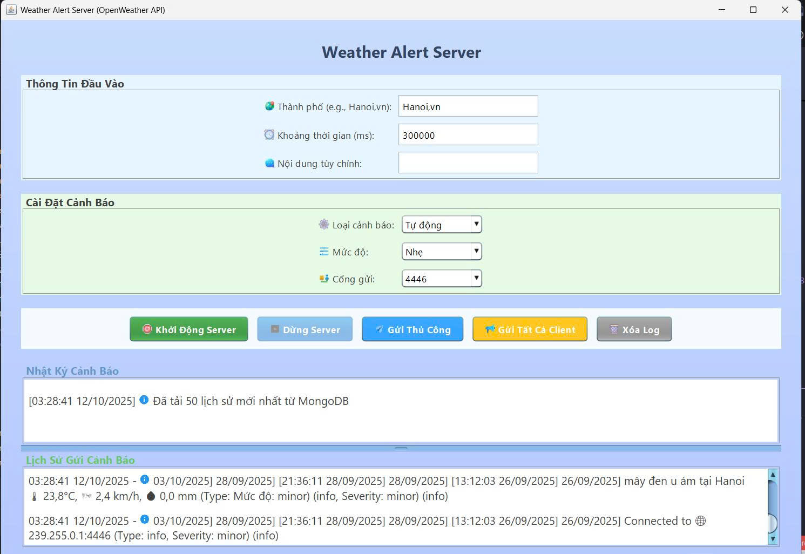
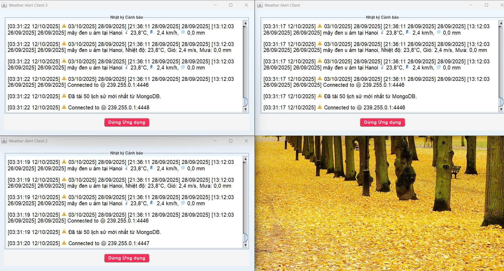
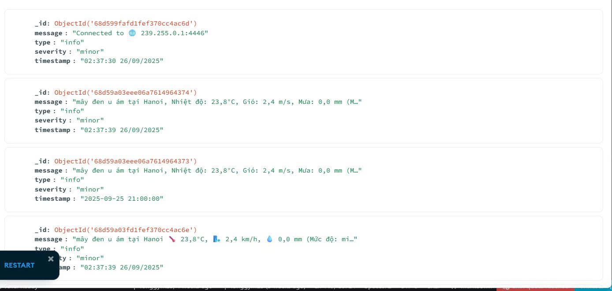
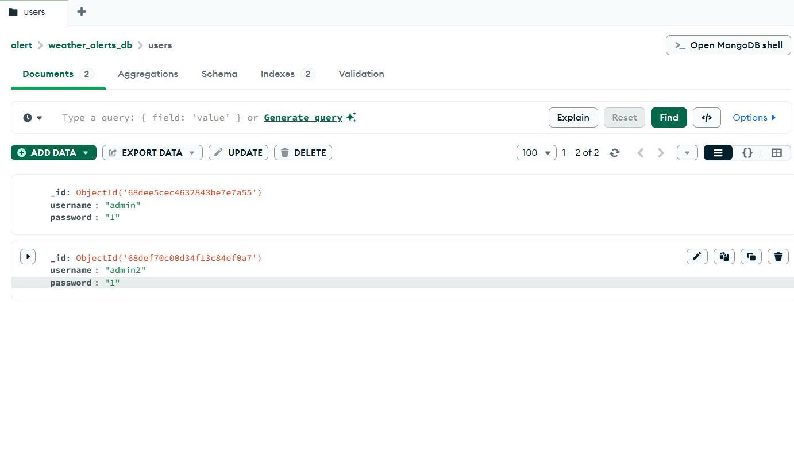
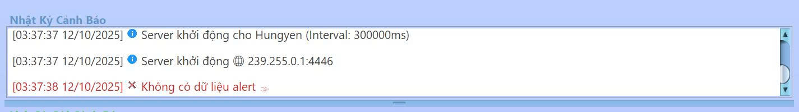
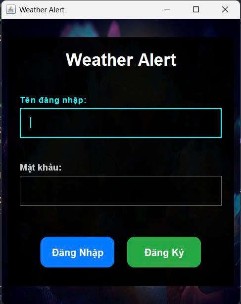

<h2 align="center">
    <a href="https://dainam.edu.vn/vi/khoa-cong-nghe-thong-tin">
    🎓 Faculty of Information Technology (DaiNam University)
    </a>
</h2>
<h2 align="center">
    HỆ THỐNG CẢNH BÁO THỜI GIAN THỰC (SERVER GỬI CẢNH BÁO TỚI NHIỀU CLIENT QUA UDP)
</h2>
<div align="center">
    <p align="center">
        
        
        
    </p>

[](https://www.facebook.com/DNUAIoTLab)
[](https://dainam.edu.vn/vi/khoa-cong-nghe-thong-tin)
[](https://dainam.edu.vn)

</div>


## 📖 1. Giới thiệu hệ thống

Hệ thống cảnh báo thời gian thực sử dụng giao thức UDP cho phép server gửi các cảnh báo thời tiết đến nhiều client theo thời gian thực thông qua cơ chế multicast. Hệ thống đã được nâng cấp với tính năng đăng nhập/đăng ký người dùng qua giao diện GUI, lưu trữ dữ liệu cảnh báo vào cơ sở dữ liệu MongoDB (bên cạnh file log), và cải thiện giao diện người dùng với icon từ file, gradient background, progress bar khi tải lịch sử.

**Server: Thu thập dữ liệu thời tiết từ OpenWeather API, định kỳ gửi các cảnh báo đến một nhóm multicast, hỗ trợ gửi thủ công với mức độ nghiêm trọng (severity).**

**Client: Nhận dữ liệu từ nhóm multicast và hiển thị cảnh báo trên giao diện người dùng (GUI). Lưu trữ dữ liệu: Các cảnh báo được lưu vào file văn bản (weather_alerts.log) và MongoDB để theo dõi lịch sử.**  

Các chức năng chính:

**🖥️ Chức năng của Server:**  

- Thu thập dữ liệu thời tiết: Gọi API OpenWeather để lấy thông tin thời tiết (nhiệt độ, tốc độ gió, lượng mưa, mô tả thời tiết) cho một thành phố cụ thể.  
- Gửi cảnh báo: Sử dụng giao thức UDP multicast để gửi các cảnh báo thời tiết đến tất cả client trong nhóm multicast, hỗ trợ mức độ nghiêm trọng (minor, moderate, severe).  
- Quản lý lịch sử: Ghi lại các cảnh báo vào log (GUI, file, và MongoDB).  
- Xử lý lỗi: Xử lý các lỗi liên quan đến API hoặc kết nối mạng, hiển thị thông báo trên GUI.  
- Giao diện người dùng: Cung cấp GUI để nhập tên thành phố, khởi động/dừng server, gửi cảnh báo thủ công, và hiển thị log cảnh báo với icon HTML từ file (icons/ folder). Hỗ trợ xóa log và progress bar khi tải lịch sử từ MongoDB.

**💻 Chức năng của Client:**  

- Kết nối nhóm multicast: Tham gia vào nhóm multicast để nhận dữ liệu từ server.  
- Hiển thị cảnh báo: Nhận và hiển thị thông tin thời tiết (mô tả, nhiệt độ, tốc độ gió, lượng mưa) trên GUI với màu sắc, biểu tượng cảm xúc phù hợp (mưa, bão, nắng nóng, v.v.), và icon từ file (icons/ folder).  
- Giao diện người dùng: Hiển thị các cảnh báo với gradient background, system tray icon, và tải lịch sử từ MongoDB (giới hạn 50 entries mới nhất).  
- Lưu trữ lịch sử: Lưu các cảnh báo vào file weather_alerts.log (hoặc weather_alerts2.log, weather_alerts3.log cho client khác) với dấu thời gian, và lưu vào MongoDB.  
- Quản lý trạng thái: Cho phép dừng client và ngắt kết nối khỏi nhóm multicast.

**🌐 Chức năng hệ thống:**  

- Giao thức UDP Multicast: SSử dụng DatagramSocket và MulticastSocket để gửi/nhận dữ liệu qua nhóm multicast (239.255.0.1:4446, với tùy chọn port thủ công).  
- Dữ liệu JSON: Dữ liệu thời tiết được truyền dưới dạng chuỗi JSON, chứa các thông tin như loại cảnh báo, mô tả, nhiệt độ, tốc độ gió, lượng mưa, vị trí, thời gian, và mức độ nghiêm trọng (severity).  
- Lưu trữ file: Các cảnh báo được ghi vào file weather_alerts.log theo định dạng có dấu thời gian, và lưu vào MongoDB (collection "alerts" với index cho timestamp).  
- Xử lý lỗi: Hiển thị thông báo lỗi trên GUI và ghi log chi tiết.
- Đăng nhập/Đăng ký: Giao diện LoginGUI sử dụng MongoDB để lưu và xác thực user (collection "users").
- Tối ưu hóa: Giới hạn tải lịch sử từ MongoDB (50 entries mới nhất), giới hạn độ dài log/history trên GUI để tránh tràn bộ nhớ.


## 🔧 2. Công nghệ sử dụng


Các công nghệ được sử dụng để xây dựng hệ thống cảnh báo thời gian thực:  

**Java Core và Multithreading: Sử dụng Timer và Thread để định kỳ gửi cảnh báo và xử lý kết nối mạng.**  

**Java Swing: Xây dựng giao diện người dùng cho cả server và client.**

**Java Sockets (UDP): Sử dụng DatagramSocket và MulticastSocket cho giao thức UDP multicast.**

**MongoDB: Sử dụng MongoDB Java Driver để lưu trữ và truy vấn cảnh báo (collection "alerts"), user (collection "users"), với index cho tối ưu query.**

**File I/O: Ghi lịch sử cảnh báo vào file văn bản (weather_alerts.log).**

**JSON Processing: Sử dụng thư viện org.json để xử lý dữ liệu thời tiết từ API.**

**Hỗ trợ GUI nâng cao: Sử dụng HTML trong JTextPane để hiển thị icon từ file (icons/ folder), gradient paint, Nimbus Look and Feel tùy chỉnh.**

Hỗ trợ:  

**java.net và java.io: Xử lý kết nối mạng và đọc/ghi file.**

**java.text.SimpleDateFormat: Tạo dấu thời gian cho các bản ghi log.**  

**javax.swing.text.html: Hiển thị log với định dạng HTML (màu sắc, biểu tượng).** 

**System Tray: Hỗ trợ tray icon cho client.**

**Sử dụng MongoDB để lưu trữ bền vững, đảm bảo ứng dụng nhẹ và dễ triển khai (không còn chỉ phụ thuộc file log).**


## 🚀 3. Hình ảnh các chức năng

<p align="center">
  
</p>

<p align="center">
  <em> Hình 1: Giao diện Server hiển thị log cảnh báo và nút điều khiển  </em>
</p>

<p align="center">
  
</p>
<p align="center">
  <em> Hình 2: Giao diện các Client hiển thị các cảnh báo thời tiết </em>
</p>


<p align="center">
  
  
</p>
<p align="center">
  <em> Hình 3: Lịch sử cảnh báo và tài khoản truy cập vào hệ thống được lưu vào cơ sở dữ liệu MongoDB </em>
</p>

<p align="center">
  
</p>
<p align="center">
  <em> Hình 4: Hiển thị thông báo lỗi khi kết nối API thất bại </em>
</p>

<p align="center">
  
</p>
<p align="center">
  <em> Hình 5: Giao diện đăng nhập hệ thống cảnh báo thời tiết </em>
</p>


## 📝 4. Hướng dẫn cài đặt và sử dụng

### 🔧 Yêu cầu hệ thống

- **Java Development Kit (JDK)**: Phiên bản 8 trở lên.
- **Hệ điều hành**: Windows, macOS, hoặc Linux.
- **Môi trường phát triển**: IDE (IntelliJ IDEA, Eclipse, VS Code) hoặc terminal/command prompt.
- **Bộ nhớ**: Tối thiểu 512MB RAM.
- **Dung lượng**: Khoảng 10MB cho mã nguồn và file thực thi.
- **Tệp cấu hình**: File config.properties chứa API key và URL của OpenWeather API.
- **MongoDB**: Server MongoDB chạy local (mongodb://localhost:27017), với database "weather_alerts_db".
- **Thư viện phụ thuộc**: MongoDB Java Driver (thêm vào classpath nếu compile thủ công).


## 📦 Cài đặt và triển khai

#### Bước 1: Chuẩn bị môi trường
1. **Kiểm tra Java**: Mở terminal/command prompt và chạy:
   ```bash
   java -version
   javac -version
   ```

Đảm bảo cả hai lệnh đều hiển thị phiên bản Java 8 trở lên.

2. **Cài đặt MongoDB**: Tải và cài MongoDB Community Server từ https://www.mongodb.com/try/download/community. Chạy server với lệnh mongod (default port 27017). Tạo database "weather_alerts_db" nếu cần (hệ thống sẽ tự tạo collections).

3. **Tải mã nguồn**: Sao chép thư mục `BTL` chứa các file:
- `AlertServer.java`
- `AlertServerGUI.java`
- `AlertClientGUI.java`
- `AlertClientGUI2.java`
- `AlertClientGUI3.java`
- `Config.java`
- `config.properties (cần cấu hình WEATHER_API_KEY và WEATHER_API_URL).`
- `LoginGUI.java (mới: giao diện đăng nhập).`
- `MongoDBManager.java (mới: quản lý MongoDB).`
- `config.properties (cấu hình WEATHER_API_KEY và WEATHER_API_URL).`
- `Folder icons/ chứa các file PNG cho icon (rain.png, storm.png, sun.png, wind.png, clear.png, info.png, error.png, background.jpg, v.v.).`


Cấu hình file config.properties:
- `WEATHER_API_KEY=your_openweather_api_key`
- `WEATHER_API_URL=http://api.openweathermap.org/data/2.5/forecast`
- `DEFAULT_CITY=Hanoi,vn`


#### Bước 2: Biên dịch mã nguồn

1. **Mở terminal** và điều hướng đến thư mục chứa mã nguồn
2. **Biên dịch các file Java**:
   ```bash
   javac Alert/*.java
   ```
   Hoặc biên dịch từng file riêng lẻ:
   ```bash
    javac Alert/AlertServer.java
    javac Alert/AlertServerGUI.java
    javac Alert/AlertClientGUI.java
    javac Alert/AlertClientGUI2.java
    javac Alert/AlertClientGUI3.java
    javac Alert/Config.java
    javac Alert/LoginGUI.java
    javac Alert/MongoDBManager.java
   ```

3. **Kiểm tra kết quả**: Nếu biên dịch thành công, sẽ tạo ra các file `.class` tương ứng. (Thêm MongoDB driver JAR vào classpath nếu cần: javac -cp .:mongodb-driver.jar Alert/*.java).


#### Bước 3: Chạy ứng dụng

**Khởi động Ứng dụng (từ Login):**
```bash
java Alert.LoginGUI
```
- Giao diện đăng nhập sẽ hiển thị.
- Đăng ký/Đăng nhập với username và password (lưu trong MongoDB).
- Sau khi đăng nhập thành công, chuyển sang AlertServerGUI.

**Khởi động Server (từ AlertServerGUI):**
- Nhập tên thành phố (ví dụ: Hanoi,vn) và nhấn "Start Server".
- Server sẽ gửi cảnh báo đến nhóm multicast 239.255.0.1:4446 mỗi 5 phút (hoặc tùy chỉnh interval).

**Khởi động Client:**
```bash
java Alert.AlertClientGUI
java Alert.AlertClientGUI2
java Alert.AlertClientGUI3
```
- Mở terminal mới cho mỗi client.
- Client tự động tham gia nhóm multicast và hiển thị các cảnh báo thời tiết, tải lịch sử từ MongoDB.

### 🚀 Sử dụng ứng dụng

1.**Server (AlertServerGUI):**

- Nhập tên thành phố vào ô nhập liệu.
- Chọn loại cảnh báo, mức độ nghiêm trọng, khoảng thời gian, nội dung tùy chỉnh.
- Nhấn "Khởi động Server" để bắt đầu gửi cảnh báo.
- Nhấn "Gửi Cảnh báo Thủ công" để gửi thủ công đến cổng được chọn.
- Nhấn "Gửi đến Tất cả Client" để gửi đến tất cả client cùng lúc.
- Nhấn "Dừng Server" để dừng.
- Nhấn "Xóa Log" để xóa log trên GUI.
- Log cảnh báo được hiển thị trên GUI (với icon từ file), lưu vào file weather_alerts.log, và MongoDB.
- Lịch sử gửi cảnh báo được hiển thị trong vùng "Lịch sử Gửi Cảnh báo" (tải từ MongoDB với progress bar).


2.**Client:**

- Tự động nhận và hiển thị các cảnh báo thời tiết từ server (với icon từ file).
- Nhấn "Dừng ứng dụng" để ngắt kết nối và thoát.
- Các cảnh báo được lưu vào file weather_alerts.log (hoặc weather_alerts2.log, weather_alerts3.log cho client khác), và MongoDB.

3.**Login (LoginGUI):**

- Nhập username và password để đăng nhập (chuyển sang Server GUI).
- Nhấn "Đăng Ký" để tạo user mới (lưu trong MongoDB).

## 📚 5. Thông tin liên hệ
Họ tên: Lê Đức Khánh Long.  
Lớp: CNTT 16-03.  
Email: khanhlong12c@gmail.com

© 2025 AIoTLab, Faculty of Information Technology, DaiNam University. All rights reserved.

---
